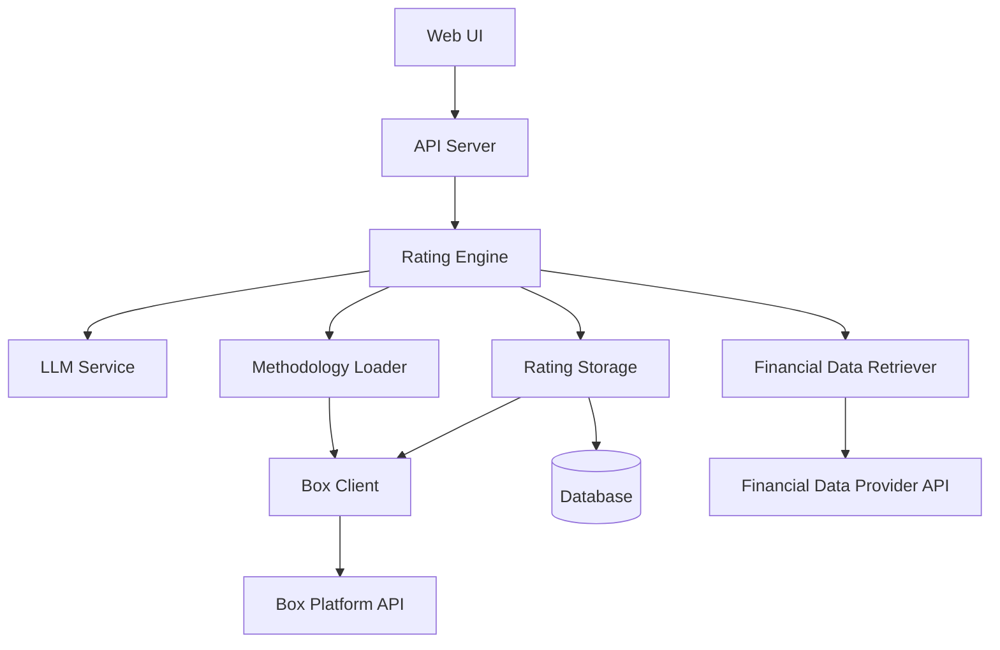
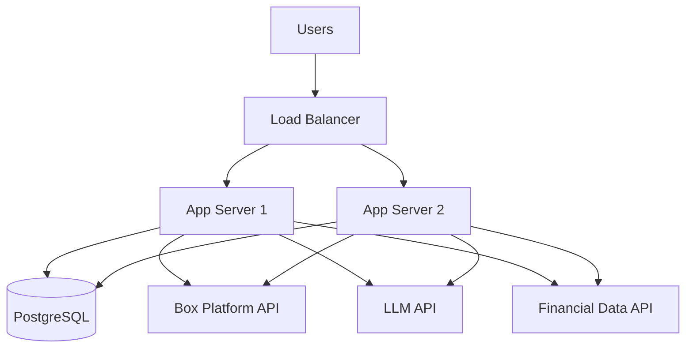

# Design Document

## Overview

The Company Credit Rating System is a web application that generates credit ratings for public companies by combining financial data retrieval with LLM-based methodology interpretation. The system accepts a company name or ticker symbol, retrieves current financial data from external providers, and applies a credit rating methodology defined in a PDF document stored in Box using an LLM to interpret and execute the methodology logic.

The architecture follows a layered approach with clear separation between the web interface, business logic, data retrieval, LLM integration, and Box platform integration layers. Box serves as the central document management platform for storing the methodology PDF, generated rating reports, and historical documentation. This design enables the system to be flexible (supporting PDF-based methodology), maintainable (clear component boundaries), secure (leveraging Box's enterprise security), and extensible (supporting future structured methodology formats).

## Architecture

The system follows a three-tier architecture:

1. **Presentation Layer**: Web-based user interface for company search, rating display, and methodology visualization
2. **Application Layer**: Business logic for orchestrating data retrieval, LLM-based rating calculation, Box integration, and result persistence
3. **Data Layer**: Integration with Box platform for document storage, financial data providers, LLM services, and database for metadata and historical ratings

### Component Diagram



## Components and Interfaces

### 1. Web UI Component

**Responsibilities:**
- Render company search interface with autocomplete
- Display credit ratings with visual indicators (letter grade, color coding)
- Show methodology breakdown and financial metrics
- Display historical ratings timeline
- Handle loading states and error messages

**Key Interfaces:**
- `searchCompanies(query: string): Promise<Company[]>` - Search for companies by name or ticker
- `generateRating(companyId: string): Promise<Rating>` - Request credit rating generation
- `getHistoricalRatings(companyId: string): Promise<Rating[]>` - Retrieve historical ratings
- `getMethodologyDetails(): Promise<MethodologyInfo>` - Get methodology documentation

### 2. API Server Component

**Responsibilities:**
- Expose REST API endpoints for UI interactions
- Validate and sanitize user inputs
- Handle authentication and rate limiting
- Coordinate between Rating Engine and other services

**Key Endpoints:**
- `GET /api/companies/search?q={query}` - Search companies
- `POST /api/ratings/generate` - Generate new rating
- `GET /api/ratings/history/{companyId}` - Get historical ratings
- `GET /api/methodology` - Get methodology information

### 3. Rating Engine Component

**Responsibilities:**
- Orchestrate the rating calculation workflow
- Retrieve financial data for target company
- Load and prepare methodology context
- Invoke LLM to apply methodology
- Parse and validate LLM output
- Store rating results

**Key Interfaces:**
```typescript
interface RatingEngine {
  calculateRating(company: Company): Promise<RatingResult>
  validateRatingOutput(output: LLMResponse): RatingResult
}

interface RatingResult {
  companyId: string
  rating: CreditRating
  score: number
  metrics: FinancialMetrics
  breakdown: MetricBreakdown[]
  timestamp: Date
  confidence: number
}
```

### 4. LLM Service Component

**Responsibilities:**
- Interface with LLM API (e.g., OpenAI, Anthropic)
- Format prompts with methodology and financial data
- Parse structured responses from LLM
- Handle retries and error cases
- Optionally cache methodology interpretations

**Key Interfaces:**
```typescript
interface LLMService {
  applyMethodology(
    methodology: string,
    financialData: FinancialData,
    options?: LLMOptions
  ): Promise<LLMResponse>
  
  convertMethodologyToStructured(
    methodologyPDF: string
  ): Promise<StructuredMethodology>
}

interface LLMResponse {
  rating: string
  score: number
  reasoning: string
  metrics: Record<string, number>
  breakdown: MetricBreakdown[]
}
```

### 5. Financial Data Retriever Component

**Responsibilities:**
- Query financial data providers (e.g., Alpha Vantage, Financial Modeling Prep, Yahoo Finance)
- Normalize data from different providers
- Validate data completeness and freshness
- Calculate derived financial metrics

**Key Interfaces:**
```typescript
interface FinancialDataRetriever {
  getCompanyData(identifier: string): Promise<FinancialData>
  searchCompanies(query: string): Promise<Company[]>
  validateDataQuality(data: FinancialData): DataQualityReport
}

interface FinancialData {
  companyId: string
  companyName: string
  ticker: string
  financialStatements: {
    balanceSheet: BalanceSheet
    incomeStatement: IncomeStatement
    cashFlowStatement: CashFlowStatement
  }
  marketData: MarketData
  dataDate: Date
}
```

### 6. Methodology Loader Component

**Responsibilities:**
- Load methodology PDF from Box
- Extract text content from PDF
- Optionally load structured methodology format from Box
- Cache methodology content for performance
- Handle Box file versioning

**Key Interfaces:**
```typescript
interface MethodologyLoader {
  loadPDFFromBox(fileId: string): Promise<string>
  loadStructured(fileId: string): Promise<StructuredMethodology | null>
  getMethodologyContent(): Promise<string>
  getLatestMethodologyVersion(): Promise<BoxFile>
}
```

### 8. Box Client Component

**Responsibilities:**
- Authenticate with Box using custom application credentials (JWT or OAuth 2.0)
- Download methodology PDF and structured files
- Upload generated rating reports
- Manage folder structure for organizing ratings by company
- Handle file versioning and metadata
- Search and retrieve historical rating documents

**Key Interfaces:**
```typescript
interface BoxClient {
  authenticate(): Promise<void>
  downloadFile(fileId: string): Promise<Buffer>
  uploadFile(folderId: string, fileName: string, content: Buffer): Promise<BoxFile>
  createFolder(parentFolderId: string, folderName: string): Promise<BoxFolder>
  searchFiles(query: string, folderId?: string): Promise<BoxFile[]>
  getFileMetadata(fileId: string): Promise<BoxFileMetadata>
  updateFileMetadata(fileId: string, metadata: Record<string, any>): Promise<void>
  getFileVersions(fileId: string): Promise<BoxFileVersion[]>
}

interface BoxFile {
  id: string
  name: string
  size: number
  createdAt: Date
  modifiedAt: Date
  version: number
}

interface BoxFolder {
  id: string
  name: string
  path: string
}

interface BoxFileMetadata {
  fileId: string
  customMetadata: Record<string, any>
}

interface BoxFileVersion {
  id: string
  versionNumber: number
  createdAt: Date
}
```

### 7. Rating Storage Component

**Responsibilities:**
- Persist generated ratings to database (metadata and quick access)
- Upload detailed rating reports to Box
- Query historical ratings from database
- Retrieve full rating reports from Box when needed
- Manage data retention policies
- Organize Box folder structure by company

**Key Interfaces:**
```typescript
interface RatingStorage {
  saveRating(rating: RatingResult): Promise<void>
  saveRatingReportToBox(rating: RatingResult, companyId: string): Promise<string>
  getHistoricalRatings(companyId: string): Promise<RatingResult[]>
  getLatestRating(companyId: string): Promise<RatingResult | null>
  getRatingReportFromBox(boxFileId: string): Promise<Buffer>
  ensureCompanyFolder(companyId: string): Promise<string>
}
```

## Data Models

### Company
```typescript
interface Company {
  id: string
  name: string
  ticker: string
  exchange: string
  sector: string
  industry: string
}
```

### CreditRating
```typescript
type CreditRating = 
  | 'AAA' | 'AA+' | 'AA' | 'AA-'
  | 'A+' | 'A' | 'A-'
  | 'BBB+' | 'BBB' | 'BBB-'
  | 'BB+' | 'BB' | 'BB-'
  | 'B+' | 'B' | 'B-'
  | 'CCC+' | 'CCC' | 'CCC-'
  | 'CC' | 'C' | 'D'
```

### FinancialMetrics
```typescript
interface FinancialMetrics {
  // Leverage ratios
  debtToEquity: number
  debtToAssets: number
  interestCoverage: number
  
  // Profitability ratios
  returnOnEquity: number
  returnOnAssets: number
  netProfitMargin: number
  operatingMargin: number
  
  // Liquidity ratios
  currentRatio: number
  quickRatio: number
  cashRatio: number
  
  // Efficiency ratios
  assetTurnover: number
  inventoryTurnover: number
  
  // Market metrics
  marketCap: number
  priceToEarnings: number
  priceToBook: number
}
```

### MetricBreakdown
```typescript
interface MetricBreakdown {
  category: string
  weight: number
  score: number
  metrics: Record<string, number>
  reasoning: string
}
```

### StructuredMethodology
```typescript
interface StructuredMethodology {
  version: string
  categories: MethodologyCategory[]
  ratingThresholds: RatingThreshold[]
}

interface MethodologyCategory {
  name: string
  weight: number
  metrics: MetricDefinition[]
}

interface MetricDefinition {
  name: string
  formula: string
  weight: number
  scoringRules: ScoringRule[]
}

interface ScoringRule {
  condition: string
  score: number
}

interface RatingThreshold {
  rating: CreditRating
  minScore: number
  maxScore: number
}
```

## Correctness Properties

*A property is a characteristic or behavior that should hold true across all valid executions of a system-essentially, a formal statement about what the system should do. Properties serve as the bridge between human-readable specifications and machine-verifiable correctness guarantees.*


### Property 1: Valid company data retrieval
*For any* valid public company identifier, the system should successfully retrieve financial data from the data provider.
**Validates: Requirements 1.1**

### Property 2: Rating generation from financial data
*For any* complete financial data set, the system should generate a valid credit rating using the LLM and methodology.
**Validates: Requirements 1.2**

### Property 3: Rating output completeness
*For any* generated credit rating, the output should contain the rating letter grade, all key financial metrics used, weights for each metric, and scores for each category.
**Validates: Requirements 2.1, 2.2, 2.3**

### Property 4: Invalid company error handling
*For any* invalid or non-existent company identifier, the system should return an error indicating the company was not found.
**Validates: Requirements 1.4**

### Property 5: LLM receives complete context
*For any* rating calculation, the LLM prompt should include both the complete methodology content and the company's financial data.
**Validates: Requirements 3.3**

### Property 6: Rating calculation idempotence
*For any* company financial data and methodology, calculating the rating multiple times should produce consistent results (same rating and score).
**Validates: Requirements 3.4**

### Property 7: Data provider query execution
*For any* company identifier submitted for rating, the system should query the financial data provider for the most recent financial statements.
**Validates: Requirements 4.1**

### Property 8: Financial data validation
*For any* retrieved financial data, the system should validate completeness and data age, rejecting incomplete data with appropriate error messages.
**Validates: Requirements 4.2, 4.3**

### Property 9: Company search returns matches
*For any* search query (partial name or ticker), the system should return all matching companies with both company name and ticker symbol included.
**Validates: Requirements 5.1, 5.2, 5.3, 5.4**

### Property 10: Rating persistence with metadata
*For any* generated credit rating, the system should store it with a timestamp and all required metadata fields.
**Validates: Requirements 6.1**

### Property 11: Historical ratings retrieval completeness
*For any* company with stored ratings, requesting historical ratings should return all previously generated ratings for that company.
**Validates: Requirements 6.2**

### Property 12: Historical ratings ordering and completeness
*For any* set of historical ratings, they should be presented in reverse chronological order with rating, date, and key metrics included for each entry.
**Validates: Requirements 6.3, 6.4**

### Property 13: Structured methodology validation
*For any* structured methodology file, the system should validate that all required parameters are present and within valid ranges, rejecting invalid configurations.
**Validates: Requirements 7.4**

### Property 14: Methodology loaded from Box
*For any* rating calculation, the methodology content should be retrieved from Box, not from local filesystem.
**Validates: Requirements 8.2**

### Property 15: Rating report uploaded to Box with metadata
*For any* generated credit rating, a detailed report should be uploaded to Box in a company-specific folder with metadata including company identifier, rating, and timestamp.
**Validates: Requirements 8.3, 8.4, 8.5**

### Property 16: Error messages sanitized
*For any* error displayed to users, the error message should not contain technical implementation details, stack traces, or sensitive information.
**Validates: Requirements 9.5**

## Error Handling

The system implements comprehensive error handling across all layers:

### Financial Data Provider Errors
- Connection failures: Retry up to 3 times with exponential backoff
- Invalid company: Return user-friendly "company not found" message
- Incomplete data: Identify and report missing fields to user
- Stale data (>12 months): Display warning but allow rating generation

### Box Platform Errors
- Authentication failures: Log error and fail system initialization
- File not found: Return clear error message indicating methodology is missing
- Upload failures: Retry up to 3 times, then log error and notify user
- Network timeouts: Implement 30-second timeout with retry logic

### LLM Service Errors
- API rate limits: Implement exponential backoff and queue requests
- Invalid responses: Validate LLM output structure and request regeneration if invalid
- Timeout: Set 60-second timeout for LLM calls
- Parsing errors: Log raw response and return error to user

### General Error Handling Principles
- All errors logged with full context for debugging
- User-facing errors sanitized to remove technical details
- Errors include actionable guidance when possible
- System maintains partial functionality when non-critical services fail

## Testing Strategy

The system will employ a dual testing approach combining unit tests and property-based tests to ensure comprehensive coverage and correctness.

### Unit Testing

Unit tests will verify specific examples, integration points, and edge cases:

- **Component Integration**: Test interactions between Rating Engine, LLM Service, and Box Client
- **Edge Cases**: Empty financial data, missing methodology file, malformed LLM responses
- **Error Scenarios**: Network failures, authentication errors, invalid inputs
- **Specific Examples**: Known company data producing expected ratings

Unit tests will use Jest (for TypeScript/Node.js) and will mock external dependencies (Box API, Financial Data Provider, LLM API) to ensure fast, deterministic test execution.

### Property-Based Testing

Property-based tests will verify universal properties that should hold across all inputs. We will use **fast-check** as the property-based testing library for TypeScript/Node.js.

**Configuration:**
- Each property test will run a minimum of 100 iterations
- Each test will be tagged with a comment referencing the correctness property from this design document
- Tag format: `// Feature: company-credit-rating, Property {number}: {property_text}`

**Property Test Coverage:**

Each correctness property listed above will be implemented as a property-based test:

1. Property 1-16: Each will have a dedicated property test that generates random valid inputs and verifies the expected behavior holds

**Generator Strategy:**

Custom generators will be created for:
- `CompanyIdentifier`: Valid company names and ticker symbols
- `FinancialData`: Complete financial statements with realistic values
- `MethodologyContent`: Valid methodology text structures
- `CreditRating`: Valid rating letter grades
- `SearchQuery`: Partial company names and ticker symbols

**Test Organization:**

```
tests/
  unit/
    rating-engine.test.ts
    llm-service.test.ts
    box-client.test.ts
    financial-data-retriever.test.ts
  properties/
    rating-calculation.properties.test.ts
    data-retrieval.properties.test.ts
    box-integration.properties.test.ts
    search.properties.test.ts
    historical-ratings.properties.test.ts
```

### Integration Testing

Integration tests will verify end-to-end workflows:
- Complete rating generation flow from company search to Box upload
- Methodology loading and caching
- Historical ratings storage and retrieval
- Error recovery and retry logic

Integration tests will use real Box sandbox environment and mock financial data provider.

## Technology Stack

### Backend
- **Runtime**: Node.js 20+ with TypeScript
- **Web Framework**: Express.js or Fastify
- **Box SDK**: Box Node SDK (official)
- **LLM Integration**: OpenAI SDK or Anthropic SDK
- **Database**: PostgreSQL for metadata and historical ratings
- **PDF Processing**: pdf-parse or pdfjs-dist
- **Testing**: Jest + fast-check

### Frontend
- **Framework**: React with TypeScript
- **UI Library**: Material-UI or Tailwind CSS
- **State Management**: React Query for server state
- **Charts**: Recharts or Chart.js for visualizing metrics

### Infrastructure
- **Hosting**: Cloud platform (AWS, GCP, or Azure)
- **Authentication**: Box JWT authentication for custom app
- **Secrets Management**: Environment variables with vault service
- **Logging**: Winston or Pino
- **Monitoring**: Application performance monitoring (APM) tool

## Security Considerations

1. **Box Authentication**: Use JWT authentication with private key stored securely, never in code
2. **API Keys**: Store LLM and financial data provider API keys in secure vault
3. **Data Privacy**: Ensure financial data is not logged or cached insecurely
4. **Access Control**: Implement user authentication and authorization for web UI
5. **Input Validation**: Sanitize all user inputs to prevent injection attacks
6. **HTTPS**: All external API calls use HTTPS
7. **Error Messages**: Sanitize error messages to avoid information disclosure

## Performance Considerations

1. **Methodology Caching**: Cache methodology content in memory to avoid repeated Box downloads
2. **LLM Response Time**: Set appropriate timeouts (60s) and provide loading indicators
3. **Database Indexing**: Index company_id and timestamp fields for fast historical queries
4. **Concurrent Requests**: Implement request queuing to manage LLM API rate limits
5. **Box File Versioning**: Use Box file version API to detect methodology updates efficiently

## Deployment Architecture



The application will be deployed as stateless containers that can scale horizontally. The database serves as the single source of truth for metadata, while Box stores all documents and reports.
