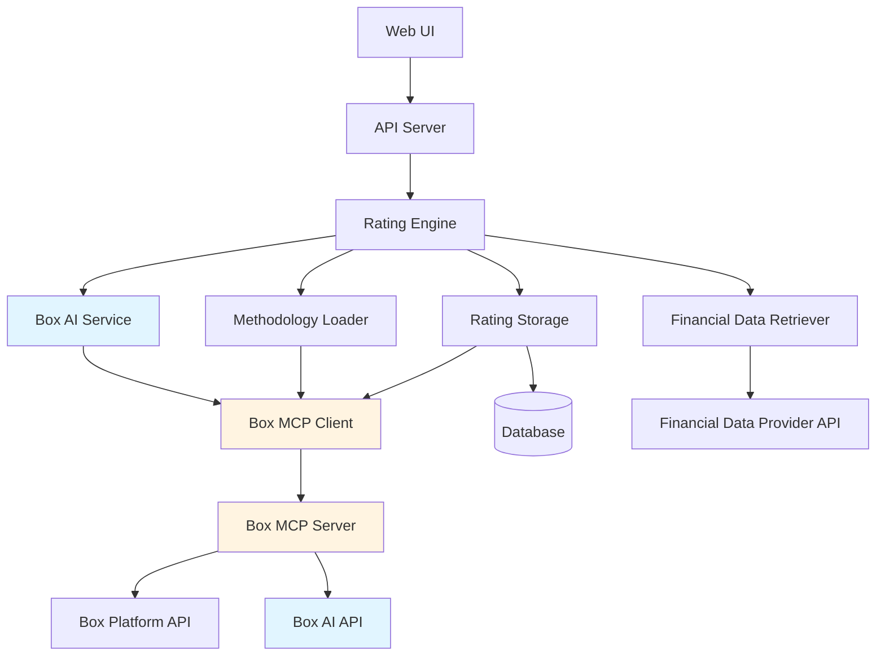
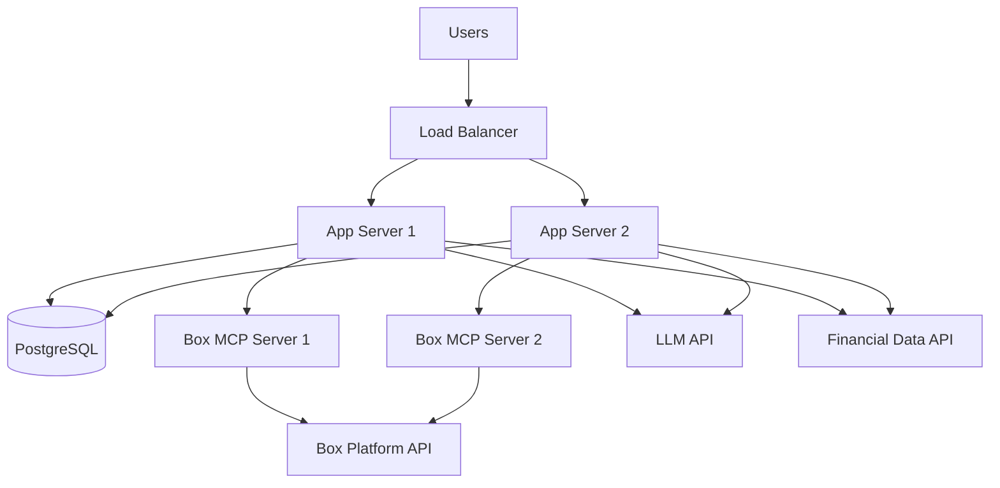

# Design Document

## Overview

The Company Credit Rating System is a web application that generates credit ratings for public companies by combining financial data retrieval with LLM-based methodology interpretation. The system accepts a company name or ticker symbol, retrieves current financial data from external providers, and applies a credit rating methodology defined in a PDF document stored in Box using an LLM to interpret and execute the methodology logic.

The architecture follows a layered approach with clear separation between the web interface, business logic, data retrieval, LLM integration, and Box platform integration layers. Box serves as the central document management platform for storing the methodology PDF, generated rating reports, and historical documentation. The system leverages the self-hosted Box MCP (Model Context Protocol) server to interact with Box, providing a standardized interface for all Box operations and eliminating the need for direct SDK integration.

**Architecture Decision - Box AI Integration:**
The system uses Box MCP for both document management and AI analysis. The Box MCP server (as documented at https://developer.box.com/guides/box-mcp/self-hosted/) provides file operations (search, read, upload, folders, metadata) and Box AI capabilities (box_ai_ask, box_ai_extract). This unified approach offers several advantages:
- **Simplified Architecture**: Single integration point for storage and AI
- **Native Document Understanding**: Box AI can directly analyze PDFs without text extraction
- **Enterprise Security**: Box AI inherits Box's security, compliance, and access controls
- **No Additional API Keys**: No need for separate OpenAI/Anthropic credentials
- **Multi-Document Analysis**: Box AI can analyze methodology PDF and financial data together

The workflow is: Upload financial data to Box → Use Box AI to analyze methodology PDF + financial data → Generate rating → Store results in Box.

## Architecture

The system follows a three-tier architecture:

1. **Presentation Layer**: Web-based user interface for company search, rating display, and methodology visualization
2. **Application Layer**: Business logic for orchestrating data retrieval, LLM-based rating calculation, Box integration, and result persistence
3. **Data Layer**: Integration with Box platform for document storage, financial data providers, LLM services, and database for metadata and historical ratings

### Component Diagram



## Components and Interfaces

### 1. Web UI Component

**Responsibilities:**
- Render company search interface with autocomplete
- Display credit ratings with visual indicators (letter grade, color coding)
- Show methodology breakdown and financial metrics
- Display historical ratings timeline
- Handle loading states and error messages

**Key Interfaces:**
- `searchCompanies(query: string): Promise<Company[]>` - Search for companies by name or ticker
- `generateRating(companyId: string): Promise<Rating>` - Request credit rating generation
- `getHistoricalRatings(companyId: string): Promise<Rating[]>` - Retrieve historical ratings
- `getMethodologyDetails(): Promise<MethodologyInfo>` - Get methodology documentation

### 2. API Server Component

**Responsibilities:**
- Expose REST API endpoints for UI interactions
- Validate and sanitize user inputs
- Handle authentication and rate limiting
- Coordinate between Rating Engine and other services

**Key Endpoints:**
- `GET /api/companies/search?q={query}` - Search companies
- `POST /api/ratings/generate` - Generate new rating
- `GET /api/ratings/history/{companyId}` - Get historical ratings
- `GET /api/methodology` - Get methodology information

### 3. Rating Engine Component

**Responsibilities:**
- Orchestrate the rating calculation workflow
- Retrieve financial data for target company
- Load methodology content from Box via MethodologyLoader
- Invoke LLM to apply methodology
- Parse and validate LLM output
- Store rating results
- Prepare source documents for archival (financial data snapshot, methodology version used)

**Key Interfaces:**
```python
from datetime import datetime
from typing import List

class RatingEngine:
    """Orchestrates the credit rating calculation workflow."""
    
    def calculate_rating(self, company: Company) -> RatingResult:
        """Calculate credit rating for a company."""
        pass
    
    def validate_rating_output(self, output: LLMResponse) -> RatingResult:
        """Validate and parse LLM output into RatingResult."""
        pass

@dataclass
class RatingResult:
    company_id: str
    rating: CreditRating
    score: float
    metrics: FinancialMetrics
    breakdown: List[MetricBreakdown]
    timestamp: datetime
    confidence: float
    source_documents: List[SourceDocument]
    methodology_version: str
```

### 4. Box AI Service Component

**Responsibilities:**
- Interface with Box AI through MCP server
- Use Box AI to analyze methodology PDF and financial data documents
- Format prompts for Box AI queries
- Parse structured responses from Box AI
- Handle retries and error cases
- Leverage Box AI's native document understanding capabilities

**Box AI Integration:**
The Box MCP server provides Box AI tools including `box_ai_ask` and `box_ai_extract` which allow querying documents stored in Box. This enables the system to:
- Ask Box AI questions about the methodology PDF directly
- Analyze financial data documents uploaded to Box
- Get structured responses from Box AI without managing separate LLM API keys
- Leverage Box's enterprise-grade AI with built-in security and compliance

**Key Interfaces:**
```python
from typing import Optional, List

class BoxAIService:
    """Interface with Box AI via MCP for methodology application."""
    
    def __init__(self, box_client: BoxMCPClient):
        """Initialize Box AI service with Box MCP client."""
        pass
    
    def apply_methodology(
        self,
        methodology_file_id: str,
        financial_data_file_id: str,
        options: Optional[Dict[str, Any]] = None
    ) -> BoxAIResponse:
        """Apply methodology to financial data using Box AI.
        
        Uses Box AI to analyze the methodology PDF and financial data
        document to generate a credit rating.
        """
        pass
    
    def ask_box_ai(
        self,
        file_ids: List[str],
        prompt: str,
        mode: str = "multiple_item_qa"
    ) -> BoxAIResponse:
        """Ask Box AI a question about one or more documents.
        
        Args:
            file_ids: List of Box file IDs to query
            prompt: Question or instruction for Box AI
            mode: Query mode - "single_item_qa" or "multiple_item_qa"
        """
        pass
    
    def extract_structured_data(
        self,
        file_id: str,
        fields: List[Dict[str, Any]]
    ) -> Dict[str, Any]:
        """Extract structured data from a document using Box AI Extract."""
        pass
    
    def convert_methodology_to_structured(
        self,
        methodology_file_id: str
    ) -> StructuredMethodology:
        """Convert PDF methodology to structured format using Box AI."""
        pass

@dataclass
class BoxAIResponse:
    rating: str
    score: float
    reasoning: str
    metrics: Dict[str, float]
    breakdown: List[MetricBreakdown]
    raw_response: str
    completion_reason: str
```

### 5. Financial Data Retriever Component

**Responsibilities:**
- Query financial data providers (e.g., Alpha Vantage, Financial Modeling Prep, Yahoo Finance)
- Normalize data from different providers
- Validate data completeness and freshness
- Calculate derived financial metrics

**Key Interfaces:**
```python
class FinancialDataRetriever:
    """Retrieve and normalize financial data from external providers."""
    
    def get_company_data(self, identifier: str) -> FinancialData:
        """Retrieve financial data for a company."""
        pass
    
    def search_companies(self, query: str) -> List[Company]:
        """Search for companies by name or ticker."""
        pass
    
    def validate_data_quality(self, data: FinancialData) -> DataQualityReport:
        """Validate completeness and freshness of financial data."""
        pass

@dataclass
class FinancialStatements:
    balance_sheet: Dict[str, Any]
    income_statement: Dict[str, Any]
    cash_flow_statement: Dict[str, Any]

@dataclass
class FinancialData:
    company_id: str
    company_name: str
    ticker: str
    financial_statements: FinancialStatements
    market_data: Dict[str, Any]
    data_date: datetime
```

### 6. Methodology Loader Component

**Responsibilities:**
- Load methodology PDF from Box
- Extract text content from PDF
- Optionally load structured methodology format from Box
- Cache methodology content for performance
- Handle Box file versioning

**Key Interfaces:**
```python
class MethodologyLoader:
    """Load and cache methodology from Box."""
    
    def load_pdf_from_box(self, file_id: str) -> str:
        """Load methodology PDF from Box and extract text."""
        pass
    
    def load_structured(self, file_id: str) -> Optional[StructuredMethodology]:
        """Load structured methodology format from Box."""
        pass
    
    def get_methodology_content(self) -> str:
        """Get cached methodology content."""
        pass
    
    def get_latest_methodology_version(self) -> Dict[str, Any]:
        """Get latest methodology file version from Box."""
        pass
```

### 8. Box MCP Client Component

**Responsibilities:**
- Connect to self-hosted Box MCP server
- Use MCP tools to interact with Box (download files, upload files, manage folders)
- Leverage MCP for methodology PDF retrieval
- Use MCP for rating report uploads and folder management
- Handle MCP tool responses and errors
- Support future Box AI capabilities if added to MCP server

The Box MCP server provides standardized tools for Box operations, eliminating the need for
**Key MCP Tools Used:**
According to https://developer.box.com/guides/box-mcp/self-hosted/, the Box MCP server provides:

**File Management Tools:**
- `box_search`: Search for files and folders in Box
- `box_get_file_info`: Get metadata about a specific file
- `box_read_file`: Download and read file contents
- `box_upload_file`: Upload new files to Box
- `box_create_folder`: Create new folders
- `box_update_file_metadata`: Add/update custom metadata on files

**Box AI Tools:**
- `box_ai_ask`: Ask questions about documents stored in Box
- `box_ai_extract`: Extract structured data from documents using AI
- Supports single and multiple document queries
- Returns AI-generated responses with citations and reasoning

**Key Interfaces:**
```python
class BoxMCPClient:
    """Client for interacting with Box via MCP server."""
    
    def connect_to_mcp(self) -> None:
        """Establish connection to MCP server."""
        pass
    
    def search_files(self, query: str, folder_id: Optional[str] = None) -> MCPToolResult:
        """Search for files in Box."""
        pass
    
    def get_file_info(self, file_id: str) -> MCPToolResult:
        """Get metadata about a specific file."""
        pass
    
    def read_file(self, file_id: str) -> bytes:
        """Download and read file contents."""
        pass
    
    def upload_file(self, folder_id: str, file_name: str, content: bytes) -> MCPToolResult:
        """Upload a new file to Box."""
        pass
    
    def create_folder(self, parent_folder_id: str, folder_name: str) -> MCPToolResult:
        """Create a new folder in Box."""
        pass
    
    def update_file_metadata(self, file_id: str, metadata: Dict[str, Any]) -> MCPToolResult:
        """Update custom metadata on a file."""
        pass

@dataclass
class MCPToolResult:
    success: bool
    data: Any
    error: Optional[str] = None
```

### 7. Rating Storage Component

**Responsibilities:**
- Persist generated ratings to database (metadata and quick access)
- Upload detailed rating reports to Box
- Upload source documents (financial statements, data snapshots) to Box for traceability
- Query historical ratings from database
- Retrieve full rating reports and source documents from Box when needed
- Manage data retention policies
- Organize Box folder structure by company and rating date

**Key Interfaces:**
```python
class RatingStorage:
    """Persist ratings to database and Box."""
    
    def save_rating(self, rating: RatingResult) -> None:
        """Save rating metadata to database."""
        pass
    
    def save_rating_package_to_box(
        self,
        rating: RatingResult,
        company_id: str,
        source_documents: List[SourceDocument]
    ) -> RatingPackageInfo:
        """Upload rating report and source documents to Box."""
        pass
    
    def get_historical_ratings(self, company_id: str) -> List[RatingResult]:
        """Retrieve historical ratings from database."""
        pass
    
    def get_latest_rating(self, company_id: str) -> Optional[RatingResult]:
        """Get most recent rating for a company."""
        pass
    
    def get_rating_report_from_box(self, box_file_id: str) -> bytes:
        """Download rating report from Box."""
        pass
    
    def get_source_document_from_box(self, box_file_id: str) -> bytes:
        """Download source document from Box."""
        pass
    
    def ensure_company_folder(self, company_id: str) -> str:
        """Create company folder in Box if it doesn't exist."""
        pass
    
    def ensure_rating_folder(self, company_id: str, rating_date: datetime) -> str:
        """Create rating-specific folder in Box."""
        pass

@dataclass
class SourceDocument:
    type: str  # 'financial_statements', 'market_data', or 'methodology_snapshot'
    content: bytes
    file_name: str
    metadata: Dict[str, Any]

@dataclass
class RatingPackageInfo:
    rating_report_file_id: str
    source_document_file_ids: List[str]
    folder_path: str
```

## Data Models

### Company
```python
from dataclasses import dataclass
from enum import Enum

@dataclass
class Company:
    id: str
    name: str
    ticker: str
    exchange: str
    sector: str
    industry: str
```

### CreditRating
```python
class CreditRating(Enum):
    AAA = "AAA"
    AA_PLUS = "AA+"
    AA = "AA"
    AA_MINUS = "AA-"
    A_PLUS = "A+"
    A = "A"
    A_MINUS = "A-"
    BBB_PLUS = "BBB+"
    BBB = "BBB"
    BBB_MINUS = "BBB-"
    BB_PLUS = "BB+"
    BB = "BB"
    BB_MINUS = "BB-"
    B_PLUS = "B+"
    B = "B"
    B_MINUS = "B-"
    CCC_PLUS = "CCC+"
    CCC = "CCC"
    CCC_MINUS = "CCC-"
    CC = "CC"
    C = "C"
    D = "D"
```

### FinancialMetrics
```python
@dataclass
class FinancialMetrics:
    # Leverage ratios
    debt_to_equity: float
    debt_to_assets: float
    interest_coverage: float
    
    # Profitability ratios
    return_on_equity: float
    return_on_assets: float
    net_profit_margin: float
    operating_margin: float
    
    # Liquidity ratios
    current_ratio: float
    quick_ratio: float
    cash_ratio: float
    
    # Efficiency ratios
    asset_turnover: float
    inventory_turnover: float
    
    # Market metrics
    market_cap: float
    price_to_earnings: float
    price_to_book: float
```

### MetricBreakdown
```python
@dataclass
class MetricBreakdown:
    category: str
    weight: float
    score: float
    metrics: Dict[str, float]
    reasoning: str
```

### StructuredMethodology
```python
@dataclass
class ScoringRule:
    condition: str
    score: float

@dataclass
class MetricDefinition:
    name: str
    formula: str
    weight: float
    scoring_rules: List[ScoringRule]

@dataclass
class MethodologyCategory:
    name: str
    weight: float
    metrics: List[MetricDefinition]

@dataclass
class RatingThreshold:
    rating: CreditRating
    min_score: float
    max_score: float

@dataclass
class StructuredMethodology:
    version: str
    categories: List[MethodologyCategory]
    rating_thresholds: List[RatingThreshold]
```

## Correctness Properties

*A property is a characteristic or behavior that should hold true across all valid executions of a system-essentially, a formal statement about what the system should do. Properties serve as the bridge between human-readable specifications and machine-verifiable correctness guarantees.*


### Property 1: Valid company data retrieval
*For any* valid public company identifier, the system should successfully retrieve financial data from the data provider.
**Validates: Requirements 1.1**

### Property 2: Rating generation from financial data
*For any* complete financial data set, the system should generate a valid credit rating using the LLM and methodology.
**Validates: Requirements 1.2**

### Property 3: Rating output completeness
*For any* generated credit rating, the output should contain the rating letter grade, all key financial metrics used, weights for each metric, and scores for each category.
**Validates: Requirements 2.1, 2.2, 2.3**

### Property 4: Invalid company error handling
*For any* invalid or non-existent company identifier, the system should return an error indicating the company was not found.
**Validates: Requirements 1.4**

### Property 5: LLM receives complete context
*For any* rating calculation, the LLM prompt should include both the complete methodology content and the company's financial data.
**Validates: Requirements 3.3**

### Property 6: Rating calculation idempotence
*For any* company financial data and methodology, calculating the rating multiple times should produce consistent results (same rating and score).
**Validates: Requirements 3.4**

### Property 7: Data provider query execution
*For any* company identifier submitted for rating, the system should query the financial data provider for the most recent financial statements.
**Validates: Requirements 4.1**

### Property 8: Financial data validation
*For any* retrieved financial data, the system should validate completeness and data age, rejecting incomplete data with appropriate error messages.
**Validates: Requirements 4.2, 4.3**

### Property 9: Company search returns matches
*For any* search query (partial name or ticker), the system should return all matching companies with both company name and ticker symbol included.
**Validates: Requirements 5.1, 5.2, 5.3, 5.4**

### Property 10: Rating persistence with metadata
*For any* generated credit rating, the system should store it with a timestamp and all required metadata fields.
**Validates: Requirements 6.1**

### Property 11: Historical ratings retrieval completeness
*For any* company with stored ratings, requesting historical ratings should return all previously generated ratings for that company.
**Validates: Requirements 6.2**

### Property 12: Historical ratings ordering and completeness
*For any* set of historical ratings, they should be presented in reverse chronological order with rating, date, and key metrics included for each entry.
**Validates: Requirements 6.3, 6.4**

### Property 13: Structured methodology validation
*For any* structured methodology file, the system should validate that all required parameters are present and within valid ranges, rejecting invalid configurations.
**Validates: Requirements 7.4**

### Property 14: Methodology loaded from Box
*For any* rating calculation, the methodology content should be retrieved from Box, not from local filesystem.
**Validates: Requirements 8.2**

### Property 15: Rating report and source documents uploaded to Box with metadata
*For any* generated credit rating, a detailed report and all source documents (financial statements, data snapshots) should be uploaded to Box in a company-specific folder with metadata including company identifier, rating, and timestamp.
**Validates: Requirements 8.3, 8.4, 8.5**

### Property 16: Error messages sanitized
*For any* error displayed to users, the error message should not contain technical implementation details, stack traces, or sensitive information.
**Validates: Requirements 9.5**

## Error Handling

The system implements comprehensive error handling across all layers:

### Financial Data Provider Errors
- Connection failures: Retry up to 3 times with exponential backoff
- Invalid company: Return user-friendly "company not found" message
- Incomplete data: Identify and report missing fields to user
- Stale data (>12 months): Display warning but allow rating generation

### Box MCP Server Errors
- MCP connection failures: Retry connection with exponential backoff, fail initialization if unable to connect
- MCP tool execution errors: Parse error responses from MCP tools and provide user-friendly messages
- File not found: Return clear error message indicating methodology is missing
- Upload failures: Retry MCP tool call up to 3 times, then log error and notify user
- Network timeouts: Implement 30-second timeout for MCP tool calls with retry logic

### LLM Service Errors
- API rate limits: Implement exponential backoff and queue requests
- Invalid responses: Validate LLM output structure and request regeneration if invalid
- Timeout: Set 60-second timeout for LLM calls
- Parsing errors: Log raw response and return error to user

### General Error Handling Principles
- All errors logged with full context for debugging
- User-facing errors sanitized to remove technical details
- Errors include actionable guidance when possible
- System maintains partial functionality when non-critical services fail

## Testing Strategy

The system will employ a dual testing approach combining unit tests and property-based tests to ensure comprehensive coverage and correctness.

### Unit Testing

Unit tests will verify specific examples, integration points, and edge cases:

- **Component Integration**: Test interactions between Rating Engine, LLM Service, and Box Client
- **Edge Cases**: Empty financial data, missing methodology file, malformed LLM responses
- **Error Scenarios**: Network failures, authentication errors, invalid inputs
- **Specific Examples**: Known company data producing expected ratings

Unit tests will use pytest and will mock external dependencies (Box MCP, Financial Data Provider, LLM API) to ensure fast, deterministic test execution.

### Property-Based Testing

Property-based tests will verify universal properties that should hold across all inputs. We will use **Hypothesis** as the property-based testing library for Python.

**Configuration:**
- Each property test will run a minimum of 100 iterations (configured via Hypothesis settings)
- Each test will be tagged with a docstring referencing the correctness property from this design document
- Tag format: `"""Feature: company-credit-rating, Property {number}: {property_text}"""`

**Property Test Coverage:**

Each correctness property listed above will be implemented as a property-based test:

1. Property 1-16: Each will have a dedicated property test that generates random valid inputs and verifies the expected behavior holds

**Generator Strategy:**

Custom generators will be created for:
- `CompanyIdentifier`: Valid company names and ticker symbols
- `FinancialData`: Complete financial statements with realistic values
- `MethodologyContent`: Valid methodology text structures
- `CreditRating`: Valid rating letter grades
- `SearchQuery`: Partial company names and ticker symbols

**Test Organization:**

```
tests/
  unit/
    rating-engine.test.ts
    llm-service.test.ts
    box-client.test.ts
    financial-data-retriever.test.ts
  properties/
    rating-calculation.properties.test.ts
    data-retrieval.properties.test.ts
    box-integration.properties.test.ts
    search.properties.test.ts
    historical-ratings.properties.test.ts
```

### Integration Testing

Integration tests will verify end-to-end workflows:
- Complete rating generation flow from company search to Box upload
- Methodology loading and caching
- Historical ratings storage and retrieval
- Error recovery and retry logic

Integration tests will use real Box sandbox environment and mock financial data provider.

## Technology Stack

### Backend
- **Runtime**: Python 3.11+
- **Web Framework**: Flask with Flask-RESTX for API documentation
- **Box Integration**: Self-hosted Box MCP Server (https://developer.box.com/guides/box-mcp/self-hosted/)
- **MCP Client**: mcp Python package for connecting to MCP server
- **AI Integration**: Box AI via MCP (box_ai_ask, box_ai_extract tools)
- **Database**: PostgreSQL with SQLAlchemy ORM
- **PDF Processing**: PyPDF2 for optional text extraction (Box AI can read PDFs directly)
- **Testing**: pytest + Hypothesis (property-based testing)

### Frontend
- **Framework**: React with TypeScript (or Flask templates with Jinja2 for simpler approach)
- **UI Library**: Bootstrap or Tailwind CSS
- **State Management**: React Query for server state (if using React)
- **Charts**: Chart.js or Plotly for visualizing metrics

### Infrastructure
- **Hosting**: Cloud platform (AWS, GCP, or Azure)
- **Authentication**: Box JWT authentication for custom app
- **Secrets Management**: Environment variables with vault service
- **Logging**: Winston or Pino
- **Monitoring**: Application performance monitoring (APM) tool

## Security Considerations

1. **Box MCP Server**: Self-hosted MCP server handles Box authentication, keeping credentials isolated from application code
2. **MCP Connection**: Secure connection to local MCP server (typically via stdio or local socket)
3. **API Keys**: Store LLM and financial data provider API keys in secure vault
4. **Data Privacy**: Ensure financial data is not logged or cached insecurely
5. **Access Control**: Implement user authentication and authorization for web UI
6. **Input Validation**: Sanitize all user inputs to prevent injection attacks
7. **HTTPS**: All external API calls use HTTPS
8. **Error Messages**: Sanitize error messages to avoid information disclosure

## Performance Considerations

1. **Methodology Caching**: Cache methodology content in memory to avoid repeated Box downloads
2. **LLM Response Time**: Set appropriate timeouts (60s) and provide loading indicators
3. **Database Indexing**: Index company_id and timestamp fields for fast historical queries
4. **Concurrent Requests**: Implement request queuing to manage LLM API rate limits
5. **Box File Versioning**: Use Box file version API to detect methodology updates efficiently

## Deployment Architecture



The application will be deployed as stateless containers that can scale horizontally. Each app server instance runs with its own Box MCP server process (or connects to a shared MCP server). The database serves as the single source of truth for metadata, while Box stores all documents and reports.

### Box MCP Server Setup

The self-hosted Box MCP server will be configured following the official guide:
- **Installation**: Install via npm: `npx -y @modelcontextprotocol/server-box <config.json>`
- **Authentication**: Configure Box Custom App with JWT authentication (config.json file)
- **Configuration**: Set up MCP server with appropriate Box folder access and AI permissions
- **Deployment**: Run MCP server as a subprocess managed by the application or via Kiro's MCP integration
- **Available Tools**: 
  - File management: search, read, upload, create folders, metadata
  - Box AI: box_ai_ask (query documents), box_ai_extract (structured data extraction)
- **AI Integration**: Box AI provides native document understanding without requiring separate LLM API keys

### Box Folder Structure

The system organizes files in Box with the following structure:

```
/Credit Ratings/
  /Methodology/
    methodology-v1.0.pdf
    methodology-v1.1.pdf
  /Companies/
    /AAPL - Apple Inc/
      /2024-01-15_Rating_AAA/
        rating-report.pdf
        financial-statements.json
        market-data.json
        methodology-snapshot.txt
      /2024-06-20_Rating_AA+/
        rating-report.pdf
        financial-statements.json
        market-data.json
        methodology-snapshot.txt
    /MSFT - Microsoft Corp/
      /2024-02-10_Rating_AAA/
        ...
```

Each rating package includes:
- **rating-report.pdf**: Human-readable rating report with analysis
- **financial-statements.json**: Complete financial data used for the rating
- **market-data.json**: Market metrics at time of rating
- **methodology-snapshot.txt**: Copy of methodology content used for this rating
